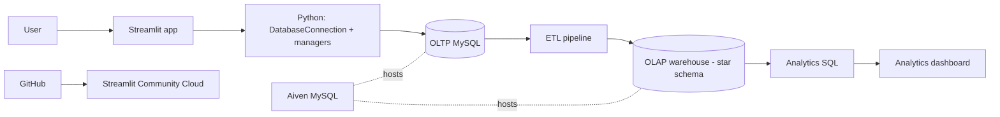

# Enterprise Employee Analytics

An end-to-end employee data platform: operational data entry (OLTP), an ETL pipeline, a star-schema data warehouse (OLAP) with **SCD Type 2** history, and a Streamlit web app with interactive analytics. The database runs on **Aiven MySQL** and the app is deployed on **Streamlit Community Cloud**.

**Live app:** https://enterprise-employee-analytics-vwrm6uzkwr63wvwzj8fvdv.streamlit.app/

> The database is on a free cloud plan that sleeps when idle. If the app shows "Down", open it again after a minute.

## What it does

| Area | Features |
|---|---|
| Employees | Onboard employees, update department / role / level / salary (SCD Type 2), search and filter the directory |
| Projects | Create projects, assign employees with a role and allocation %, view teams (warns above 100% total allocation) |
| Reviews | Submit a 1-5 rating with comments, view review history |
| Analytics | Year-over-year performance (`LAG()`), top performers per department (`DENSE_RANK()`), attrition risk, project bottlenecks |

Every save runs as **one transaction**: write to the OLTP database, sync the warehouse with a stored procedure, then commit (or roll everything back).

## Architecture



## Tech stack

Python 3, pandas, Faker, MySQL 8 (stored procedures, CTEs, window functions), mysql-connector-python, Streamlit, Plotly, python-dotenv, Git/GitHub, MySQL Workbench, Aiven MySQL, Streamlit Community Cloud.

## Repository structure

```
app/            Streamlit app and OOP backend
  db_manager.py   DatabaseConnection (Singleton, thread-safe, transactions)
  entities.py     Employee, Project, Review (validated attributes)
  managers.py     EmployeeManager, ProjectManager, ReviewManager (OLTP), AnalyticsManager (OLAP)
  ui_helpers.py   shared Streamlit helpers (cached lookups)
  streamlit_app.py  home page (connection status + KPIs)
  pages/          1_Onboarding.py, 2_Projects.py, 3_Reviews.py, 4_Analytics.py
python/         data_synthesizer.py, inspect_dataset.py, validate_synthetic_data.py, etl_pipeline.py
sql/            01_olap_ddl, 02_olap_dml, 03_stored_procedures, 04_cte_queries, 05_window_functions,
                06_app_support, 07_seed_demo_data, 08_aiven_setup, schema (OLTP)
data/           IBM HR dataset + synthesized CSVs
diagrams/       ER diagram and dimensional model (MySQL Workbench)
tests/          smoke_test.py (34 end-to-end checks)
```

## Data model

**OLTP (normalized):** `Employee`, `Department`, `JobRole`, `EducationField`, `Project`, `Assignment`, `Reviews`, plus `employee_scd_history`. Primary and foreign keys enforce integrity.

**OLAP (star schema):**

| Type | Tables |
|---|---|
| Dimensions | `DimEmployee` (SCD Type 2), `DimDepartment`, `DimJobRole`, `DimEducationField`, `DimProject`, `DimDate` |
| Facts | `FactEmployee`, `FactAssignment`, `FactReview` |

All dimensions use surrogate keys. `DimEmployee` keeps history with `effective_start_date`, `effective_end_date` and `is_current`, so a department or salary change closes the old row and opens a new one instead of overwriting it.

| employee_key | department | job_level | monthly_income | start | end | is_current |
|---|---|---|---|---|---|---|
| 110004 | Sales | 2 | 6000 | 2025-01-01 | 2026-10-03 | 0 |
| 110005 | Research & Development | 3 | 7500 | 2026-10-04 | NULL | 1 |

*(illustrative example of one employee's two versions)*

## Data synthesis

`python/data_synthesizer.py` (`EmployeeDataSynthesizer`) scales the 1,470-row IBM HR Analytics dataset to **100,000 employees** using pandas and Faker (names and emails). For 10% of employees (10,000) it creates an older version (2023-01-01 to 2024-12-31, lower salary, sometimes a lower level or different department) and a current version from 2025-01-01, giving **20,000 history rows** for SCD Type 2.

## ETL

`python/etl_pipeline.py` and the SQL scripts **extract** from OLTP, **transform** (remove duplicates and rows with missing IDs, build SCD Type 2 versions) and **load** dimensions first, then facts. Verified load: 100,000 employees, `DimDepartment` 3, `DimJobRole` 9, `DimEducationField` 6, `DimProject` 30, `DimDate` 1,096, `FactEmployee` 100,000, `FactAssignment` 26,508, `FactReview` 104,945. Dimension loads can be re-run safely.

## Analytics

| Analysis | Technique |
|---|---|
| Year-over-year performance | `LAG()` over each department by year |
| Top performers | `DENSE_RANK()` per department (ties share a rank) |
| Attrition risk | CTE risk score 0-8 (overtime, low job/environment satisfaction, poor work-life balance, 5+ years without promotion, 20+ km commute, pay below 80% of department average, tenure of 2 years or less); High (5+), Medium (3-4), Low |
| Project bottlenecks | CTEs + `RANK()` on members whose total allocation exceeds 100% |

## Run it locally

Requirements: Python 3.11+, MySQL 8, Git (MySQL Workbench is helpful).

```bash
git clone https://github.com/Shravani-A-Kulkarni/Enterprise-Employee-Analytics.git
cd Enterprise-Employee-Analytics
python -m venv .venv
.venv\Scripts\activate            # macOS/Linux: source .venv/bin/activate
pip install -r requirements.txt
cp .env.example .env              # then fill in your MySQL values
```

1. Create the OLTP database: run `sql/schema.sql` in MySQL Workbench (edit the CSV paths inside it for your machine).
2. Run `sql/01_olap_ddl.sql`, then `sql/02_olap_dml.sql` (creates and loads the warehouse).
3. Run `sql/07_seed_demo_data.sql` **once** (more projects, assignments and reviews; fixes the overtime column). For speed, first run `CREATE INDEX idx_staging_empno ON employee_staging (EmployeeNumber);`.
4. Run `sql/06_app_support.sql` (app stored procedures).
5. Load the new rows into the warehouse: `python python/etl_pipeline.py`
6. Check everything: `python tests/smoke_test.py` (should end with `ALL CHECKS PASSED`)
7. Start the app: `streamlit run app/streamlit_app.py`

### Configuration (`.env`, never committed)

| Variable | Meaning |
|---|---|
| `MYSQL_HOST`, `MYSQL_PORT` | database server |
| `MYSQL_USER`, `MYSQL_PASSWORD` | credentials |
| `OLTP_DB`, `OLAP_DB` | `enterprise_employee_analytics`, `enterprise_employee_analytics_olap` |
| `MYSQL_SSL_CA` | path to the CA certificate for hosted MySQL (e.g. `ca.pem`) |

## Deployment

1. Create a free **Aiven MySQL** service and export the two local databases (Workbench Data Export), then import them into Aiven.
2. Aiven runs on Linux, where table names are case-sensitive: run `sql/08_aiven_setup.sql` once to restore the table names and create the 5 stored procedures.
3. On **Streamlit Community Cloud**, create an app from this repository: branch `main`, main file `app/streamlit_app.py`, and paste the settings above into **Secrets** (use `MYSQL_SSL_CA = "ca.pem"`).

Passwords live only in `.env` (git-ignored) or Streamlit Secrets, never in the code.

## Testing

`python tests/smoke_test.py` runs 34 checks against the real databases: Singleton and connections, entity validation, onboarding and warehouse load, SCD Type 2 and rollback, projects, assignments and reviews (including duplicate and invalid input), and every analytics query. The deployed app was also tested end to end.

## Git workflow

Work was done on feature branches (`feature/data-oltp`, `feature/olap-etl-datawarehouse`, `feature/streamlit-app`, `feature/deployment`) and merged into `main` through Pull Requests.

## Team

| Part | Owner |
|---|---|
| Data synthesis and OLTP database | Subhaprada |
| Data warehouse and ETL | Shravani |
| Python OOP backend, Streamlit app, analytics dashboard, deployment | Keerthi |

## Limitations and future scope

The data is synthetic, and the attrition score is a transparent rule-based model rather than machine learning. Future work: predictive attrition models, role-based authentication, scheduled ETL, more dashboards and KPIs, alerts for high-risk employees, project capacity planning and CI/CD.
